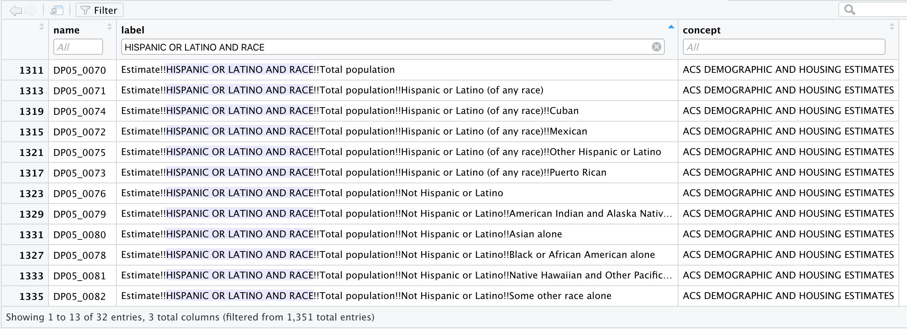
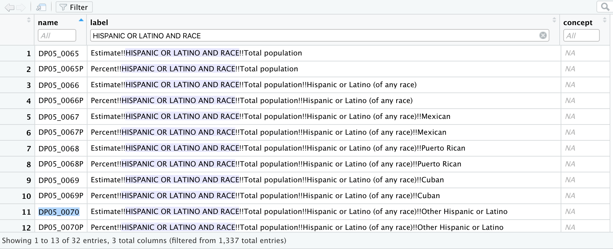

<style type="text/css">

body, td {
   font-size: 16px;
}
code.r{
  font-size: 16px;
}
pre {
  font-size: 12px
}
</style>

```{r, echo=FALSE, message=FALSE}
# install.packages("usethis")
# install.packages("rlang")
# install.packages("devtools")
# devtools::install_github("hadley/devtools")
# devtools::install_github("Hemken/Statamarkdown")
# install.packages("reticulate")
# install.packages("dplyr")
# install.packages("rvest")
# install.packages("kableExtra")
# install.packages("tibble")
# install.packages("readxl")
# install.packages('hrbrthemes')
# install.packages('plotly')
# install.packages("ggplot2")
# install.packages("DT")
library(DT)
library(bookdown)
library(tinytex)
library(usethis)
library(devtools)
library(Statamarkdown)
library(rvest)
library(readxl)
library(dplyr)
library(knitr)
library(kableExtra)
library(tibble)
library(readr)
library(tidyr)
```


```{r, include=FALSE}
#add Python chunks
library(reticulate)
#use_python("/usr/local/bin/python")
#use_virtualenv("r-reticulate")
#py_available(TRUE)
#py_install("pandas")
#py_install("matplotlib")
```

```{r, include=FALSE}
knitr::opts_chunk$set(collectcode=FALSE, 
                      # comment out the line below to execute Stata code
                      # eval=FALSE, 
                      savedo=TRUE
                      )
options(knitr.kable.NA = "")
```

```{stata, include=FALSE, savedo=FALSE}
set rmsg off
set more off
set linesize 120
```

](figures/census.png)

The United States Census Bureau collects a vast amount of demographic, social, and economic data about the United States. Census core resources include the decennial Census, the American Community Survey, and the population estimates. The decennial Census is conducted every ten years and is a complete count of the United States population. The American Community Survey, or ACS, in contrast, is a survey of around 3 million households taken every year. Whereas the decennial Census asks only about core demographic characteristics like age and race, the ACS asks a much broader range of questions [^1]. The third data source we will discuss here comes from the Census Bureau’s [Population Estimates Program (PEP)](https://www.census.gov/programs-surveys/popest.html). The decennial census publishes the definitive population of the United States every ten years. However, if you want to know the population of a U.S. geographic area between decennial census years, you will need to use the Population Estimates. The ACS also includes population estimates, but the estimation techniques used for the Population Estimates Program are more accurate [^2].

[^1]: Datacamp. [Analyzing US Census Data in R.](https://learn.datacamp.com/courses/analyzing-us-census-data-in-r)

[^2]: Sara Altman & Bill Behrman. [Data Wrangling.](http://dcl-wrangle.stanford.edu/)

## Working with the Census Data API Using tidycensus

#### **Installing tidycensus**

The US Census Bureau makes its data available to users via an Application Programming Interface or API. The tidycensus R package wraps the decennial Census and ACS APIs, allowing R users to access Census data directly. 

To get started working with tidycensus, we need to make sure that the required packages are installed:

```{r, eval = FALSE, message=FALSE, warning=FALSE, results="hide"}
if (!require(tidyverse)) install.packages('tidyverse')
if (!require(tidycensus)) install.packages('tidycensus')
```

Next, let's load the libraries:

```{r eval=TRUE, message=FALSE}
library(tidyverse)
library(tidycensus)
```

Lastly, users should set their Census API key:

 * Sign up for a Census API key [here](https://api.census.gov/data/key_signup.html)
 * Store for future use with the `census_api_key()` function. Setting `install = TRUE` will store the key on the user's computer for future use
 
```{r eval=FALSE}
census_api_key("pasteyourkeyhere", install = TRUE)
```
  
If you want to check your API key after you have set it up, use:

```{r, eval = FALSE}
Sys.getenv("CENSUS_API_KEY")
```

#### **Searching for data with tidycensus**

Getting variables from the Census or ACS requires knowing the variable *ID* - and there are thousands of these IDs across the different Census files. Understanding variable ID codes from the ACS can be confusing, so let's go through it here for the variable `B19001_002E`, which refers to *the number of households with an income of less than $10,000 in the past 12 months* [^3].

[^3]: Ibid.

**********

**ACS Variable Structure**

*Anatomy of an ACS variable `B19001_002E`*

* The American Community Survey (ACS) provides five different sets of data tables:

  + The **B** prefix refers to the fact that this variable comes from a **base** (or **detailed**) table, which gives the most detail available in the ACS.
  
  + Other available tables in tidycensus include **collapsed** tables, denoted by **C**. The collapsed tables cover
the same topics as the base tables, but with fewer details.
  
  + **Data profile** tables, denoted by **DP**. These tables are designed to provide information on a broad array of characteristics for a given geography. There are data profile tables on:

      + Social Characteristics (DP02),
      + Economic Characteristics (DP03),
      + Housing Characteristics (DP04), and
      + Demographic Characteristics (DP05).  
      
       > *Note*: Estimates of the data profile tables are presented in two forms: numbers and percentages, denoted by **P**.
      
  + **Subject** tables, denoted by **S**. These tables are designed to provide information on narrower topics for a broader range of geographies.

  + **Comparison profile** tables, denoted by **CP**. These tables provide information on changes in characteristics in particular geographies over time, including statistical significance testing [^4]. 
  
    > *Note*: The tidycensus package does not support the Comparison profile tables yet. If you need them, use the censusapi package [^5].


[^4]: Julien Leider. [CensusData 1.13 documentation.](https://jtleider.github.io/censusdata/variables.html#obtaining-information-on-variables-through-the-censusdata-package)

[^5]: Kyle Walker. [Comparison Profile tables.](https://github.com/walkerke/tidycensus/issues/126)

* The component **19001** refers to the table ID. In this case, the variable belongs to a table of related variables, which cover different household income bands. 

* **002** then refers to the specific variable ID within that table. 

* The suffix **E** refers to estimate and is not required by tidycensus functions. Almost every variable in the ACS is characterized by a margin of error, and tidycensus is designed to return both the estimate and margin of error by default. Margin of error variables have the suffix **M**; you will only see these suffixes when returning data in wide format [^6].

[^6]: Datacamp. [Analyzing US Census Data in R](https://learn.datacamp.com/courses/analyzing-us-census-data-in-r)

**********

To rapidly search for variables, use the `load_variables()` function. The function takes two required arguments: the `year` of the Census or endyear of the ACS sample, and the `dataset`.

`Dataset` can take one of the following arguments:

* `sf1` - Summary File 1. This is a 100% sample of the whole population of the United States, down to the Census Block level. It has information on age, sex, race, Hispanic/Latino origin, household relationship, whether residence is owned or rented [^7].

[^7]: NC State University. [Census Data Overview.](https://projects.ncsu.edu/woodlands//current_pdfs/teleconf_data_sources.pdf)

* `sf3` - Summary File 3. This is a 1-in-6 sample of the population, down to the Census Block Group level (less resolution than SF1). It presents detailed population and housing data (such as place of birth, education, employment status, income, value of housing unit) [^8].

[^8]: Ibid.

* `acs1`, `acs3`, `acs5` - ACS, Base and Collapsed Tables, 1-year, 3-year, or 5-year Estimates

* `acs1/profile`, `acs3/profile`, `acs5/profile` - ACS, Data Profile Tables

* `acs1/subject`, `acs3/subject`, `acs5/subject` - ACS, Subject Tables

There is also the optional `cache` parameter that allows users to store the variables dataset on their computer to speed up future browsing.

Let's say we want to examine the US population estimates by race and ethnicity from the ACS survey. We need to load variables from the ACS dataset and search for variables that correspond with our query. 

```{r}
columns_names <- load_variables(year= 2019, dataset = "acs1/profile", cache = TRUE)
```

You can use the `View()` function in RStudio to interactively browse for variables.

```{r eval=FALSE, results='hide'}
View(columns_names)
```



By filtering for “HISPANIC OR LATINO AND RACE” we can quickly view the variable IDs that correspond to our query:

* `DP05_0070` - Total population
* `DP05_0071` - Hispanic or Latino (of any race)
* `DP05_0077` - White alone
* `DP05_0078` - Black or African American alone
* `DP05_0079` - American Indian and Alaska Native alone
* `DP05_0080` - Asian alone
* `DP05_0081` - Native Hawaiian and Other Pacific Islander alone
* `DP05_0082` - Some other race alone
* `DP05_0083` - Two or more races (not Hispanic or Latino)

Now, let's save these IDs to a variable so we can pull the data for them later on:

```{r}
vars_acs_1 <-
  c(
    total = "DP05_0070",
    white = "DP05_0077",
    black = "DP05_0078",
    native = "DP05_0079",
    asian = "DP05_0080",
    hawaiian = "DP05_0081",
    other = "DP05_0082",
    multiple = "DP05_0083",
    hispanic = "DP05_0071"
  )
```

We can also save a dataframe with the names and labels of the variables we chose for future reference:

```{r, results='hide'}
filtered_names <- filter(columns_names, str_detect(name, paste(vars_acs_1, collapse = "|")))
```

#### **Basic tidycensus functionality**

There are three core functions implemented in tidycensus: `get_decennial()`, which grants access to the 1990, 2000, or 2010 decennial US Censuses, with 2010 as the default, `get_acs()`, which grants access to the 1-year and 5-year American Community Survey APIs, and  `get_estimates()`, which grants access to the Population Estimates API that includes information on a wide variety of population characteristics that is updated annually.

At minimum, you should supply `get_acs()`, `get_decennial()`, and `get_estimates()` with two variables:

* `variables`
* `geography`

```{r echo=FALSE}
data <- "https://walkerke.github.io/tidycensus/articles/basic-usage.html" %>%
  read_html %>%
  html_table(header = TRUE, fill = TRUE)

data[[1]] %>%
  as_tibble %>%
  knitr::kable(align = "c", 
               booktabs = TRUE,
               linesep = "",
               caption = 'List of geographies in tidycensus [^9].') %>%
  kable_styling(bootstrap_options = c("striped", "hover", "condensed"))
```


[^9]: Kyle Walker. [Basic usage of tidycensus.](https://walker-data.com/tidycensus/articles/basic-usage.html#searching-for-variables-1)

The **Standard Hierarchy of Census Geographic Entities** displays the relationships between legal, administrative and statistical boundaries maintained by the Census Bureau. It depicts relationships with a line and shows where relationships do not exist by displaying entities on different line tracks. In short, it shows how different geographic areas may, or may not, be related [^10].

[^10]: Katy Rossiter. [Understanding Geographic Relationships: Counties, Places, Tracts and More.](https://www.directionsmag.com/article/1330)

](figures/census-geo.png)

Note that most datasets provide data for only a subset of these geographies. For example:

* The Decennial Census publishes data down to Block level (the smallest geography).

* The American Community Survey (ACS) publishes data down to the Block Group level (the level above Blocks).

* The Population Estimates Program (PEP) only publishes data down to the county level (two levels above the Block Group level) [^11].

[^11]: Ari Lamstein and Logan Powell. [A Guide to Working with US Census Data in R.](https://rconsortium.github.io/censusguide/)

##### *Obtaining data using get_decennial()*

Let's start by familiarizing ourselves with the `get_decennial()` function and pull the decennial Census U.S. population data by race and ethnicity and create a share based on total population:

```{r message=FALSE, warning=FALSE}
total <- "P005001"

vars_decennial <-
  c(
    white = "P005003",
    black = "P005004",
    native = "P005005",
    asian = "P005006",
    hawaiian = "P005007",
    other = "P005008",
    multiple = "P005009",
    hispanic = "P005010"
  )

df_decennial <-
  get_decennial(
    geography = "us", 
    variables = vars_decennial, 
    year = 2010,
    summary_var = total
  )%>%  
  mutate(share = round(100 * (value / summary_value),2))

datatable(df_decennial, filter="top", options = list(pageLength = 5, scrollX=T) )
```

If we want our dataframe to be in the wide form, we can specify `output = "wide"`:

```{r echo=TRUE, message=FALSE, warning=FALSE}
df_decennial <-
  get_decennial(
    geography = "us", 
    variables = vars_decennial, 
    year = 2010,
    summary_var = total,
    output = "wide"
  )

datatable(df_decennial, filter="top", options = list(pageLength = 5, scrollX=T) )
```

##### *Using ACS data with tidycensus*

The `get_acs()` function allows R users to request data from the American Community Survey. The default dataset obtained by `get_acs()` is the 5-year, 2015-2019 ACS sample.

> *Note*: 5-year ACS data is available from 2009 through 2019. 1-year ACS data is available from 2005 through 2019. 

As ACS data are based on survey samples, they represent estimates of population characteristics rather than exact data. Whereas `get_decennial()` returns a data **value** for each row, `get_acs()` returns **estimate** and **moe** columns representing the ACS estimate and margin of error around that estimate with a confidence level of 90 percent [^12].

> *Note*: The default moe is 90, but we can change it to 95 (or 99) by specifying `moe_level = 95`.

[^12]: Kyle Walker. [Basic usage of tidycensus](https://walker-data.com/tidycensus/articles/basic-usage.html#searching-for-variables-1)

Let's use the variable `vars_acs_1` that we created earlier and pull 1-year population estimates for 2019 by race and ethnicity for the state of Illinois from the ACS survey:

```{r}
df_acs_1 <-
  get_acs(
    geography = "state",
    state = "IL", 
    variables = vars_acs_1, 
    year = 2019,
    survey = "acs1",
    show_call = TRUE
  )
```

To pivot the data into a wider format, we can also use the `pivot_wider()` function:

```{r}
df_acs_v2 <- df_acs_1 %>% 
              pivot_wider(
                names_from = variable, 
                values_from = c(estimate, moe)
            )

datatable(df_acs_v2, filter="top", options = list(pageLength = 5, scrollX=T) )

```

Check data reliability with CVs:

```{r}
df_acs_1 %>%
  mutate(
    se = moe / 1.645,
    cv = se / estimate,
    reliable = cv < 0.3
  ) %>%
  count(reliable) 
```

> *Note*: "NA" here shows us that the variable `total` does not nave MOE.

Let's see how the total population of New York County has changed over 10 years. To download multiple year data at one time, we will need to use the `map()` [family of functions](https://purrr.tidyverse.org/reference/map.html) from the purrr package.
Let's install the purrr package:

```{r, eval = FALSE, message=FALSE, warning=FALSE, results="hide"}
if (!require(purrr)) install.packages('purrr')
```

Load the `purrr` library:
 
```{r message=FALSE, warning=FALSE}
library(purrr)
```

And finally, pull multiple years of data:

```{r message=FALSE, warning=FALSE}
total_population <- map_dfr(
  2009:2018, function(.x) {
    
    get_acs(geography = "county", state = "NY", 
            county = "New York County",
            variables = "DP05_0070",
            year = .x, survey = "acs1") %>%
      mutate(year = .x, .before = GEOID)
  }
)
```

Another way to do it is to loop over a named list of years:

```{r message=FALSE, warning=FALSE}
years <- lst(2009, 2010, 2011, 2012, 2013, 2014, 2015, 2016, 2017, 2018)

total_population_v2 <- map_dfr(
  years,
  ~ get_acs(
    geography = "county", state = "NY", 
    county = "New York County",
    variables = "DP05_0070",
    year = .x,
    survey = "acs1"
    ),
  .id = "year"
  )

datatable(total_population_v2, filter="top", options = list(pageLength = 10, scrollX=T) )
```

On the table above, we can see that our population estimates increased drastically in 2017. This does not seem right. In 2017 table IDs have changed, so the data that we see before 2017 is not total population estimates. Let's find out what it is:

```{r}
columns_names <- load_variables(year= 2016, dataset = "acs1/profile", cache = TRUE)
```



We see that `DP05_0070` in 2016 and before represents "Other Hispanic or Latino population", and the correct column for our analysis would be `DP05_0065`. Let's correct this mistake, pull the data for the different variable IDs for years before and after 2017, bind the datasets, and sort data by year:

```{r message=FALSE, warning=FALSE, results="hide"}
total_population <- map_dfr(
  2017:2018, function(.x) {
    
    get_acs(geography = "county", state = "NY", 
            county = "New York County",
            variables = "DP05_0070",
            year = .x, survey = "acs1") %>%
      mutate(year = .x, .before = GEOID)
  }
)

total_population2 <- map_dfr(
  2009:2016, function(.x) {
    
    get_acs(geography = "county", state = "NY", 
            county = "New York County",
            variables = "DP05_0065",
            year = .x, survey = "acs1") %>%
      mutate(year = .x, .before = GEOID)
  }
)

# bind these two dataframes
total <- rbind(total_population,total_population2)
total[ order(total$year), ] 
```

In addition, we can build a line chart to examine the data visually: 

```{r message=FALSE, warning=FALSE, include=FALSE}
extrafont::loadfonts()
```

```{r, fig.align = 'center'}
library(ggplot2)
library(dplyr)
library(hrbrthemes)

# Plot
total %>%
  tail(10) %>%
  ggplot( aes(x=year, y=estimate)) +
    geom_line( color="grey") +
    geom_point(shape=21, color="black", fill="#69b3a2", size=6) +
    theme_ipsum() +
    ggtitle("New York County Population, 2008-2018")
```

##### *Obtaining population estimates through the get_estimates() function*

For population estimates outside decennial census years, you will need to work directly with the [Population Estimates APIs](https://www.census.gov/data/developers/data-sets/popest-popproj/popest.html). Estimates are organized into products, which in tidycensus include `"population"`, `"components"`, `"housing"`, and `"characteristics"`. The population and housing products contain population/density and housing unit estimates, respectively. The components of change and characteristics products, in contrast, include a wider range of possible variables [^13]. The full list of variables is available [here](https://www.census.gov/data/developers/data-sets/popest-popproj/popest.html).

[^13]: Kyle Walker. [Other Census Bureau datasets.](https://walker-data.com/tidycensus/articles/other-datasets.html)

> *Note*: Available geographies for the `get_estimates` function include `"us"`, `"state"`, `"county"`, `"metropolitan statistical area/micropolitan statistical area"`, and `"combined statistical area"`.

Let's pull latest population estimates for the states:

```{r}
state_population <- get_estimates(geography = "state", product = "population", year = 2019)

datatable(state_population, filter="top", options = list(pageLength = 5, scrollX=T) )
```

Population Estimates API is not available in tidycensus for years prior to 2015. Consider using `time_series = TRUE` or the censusapi package for earlier estimates. Using `time_series = TRUE` will give you estimates for each date going back to 2010. See [here](https://www.census.gov/data/developers/data-sets/popest-popproj/popest/popest-vars/2018.html) for how to interpret the `DATE` variable in the dataframe below. 

> *Note*: As of May 2021, the Vintage 2019 estimates are the most recent, fully available estimates.

```{r}
state_population <- get_estimates(geography = "state", product = "population", year = 2019, time_series = TRUE)

datatable(state_population, filter="top", options = list(pageLength = 5, scrollX=T) )
```

We can also pull the data on the county level and map it:

```{r}
county_population <- get_estimates(geography = "county",
                               variables = "POP",
                               geometry = TRUE,
                               shift_geo = TRUE)

summary(county_population)
```


```{r, fig.align = 'center'}
order = c("10,000 and below", "10,000 to 25000", "25000 to 70000", "70000 to 100,000", "100,000 and up")

county_population <- county_population %>%
  mutate(groups = case_when(
    value > 100000 ~ "100,000 and up",
    value > 70000 ~ "70000 to 100,000",
    value > 25000 ~ "25000 to 70000",
    value > 10000 ~ "10,000 to 25000",
    TRUE ~ "10,000 and below"
  )) %>%
  mutate(groups = factor(groups, levels = order))

ggplot() +
  geom_sf(data = county_population, aes(fill = groups, color = groups), lwd = 0.1) +
  geom_sf(data = tidycensus::state_laea, fill = NA, color = "black", lwd = 0.1) +
  scale_fill_brewer(palette = "PuOr", direction = -1) +
  scale_color_brewer(palette = "PuOr", direction = -1, guide = FALSE) +
  theme_minimal(base_family = "Arial") +
  labs(title = "U.S. Population by county",
       subtitle = "US Census Bureau 2019 Population Estimates",
       fill = "Population")
```

Now, as we know what data we can get with the `population` and `housing` products, let's find out more about the `components` of change and `characteristics` products.

```{r}
us_components <- get_estimates(geography = "state", product = "components")
unique(us_components$variable)
```

The variables included in the components of change `product` consist of both estimates of *counts* and *rates*. Rates are preceded by an **R** in the variable name and are calculated per 1000 residents. 

If desired, users can request a specific component or components by supplying a character vector to the `variables` parameter and leave out the `product` parameter altogether. In the example below, we will acquire data on the net international migration rate between 2018 and 2019 by metropolitan statistical area/micropolitan statistical area.

```{r}
net_int_migration <- get_estimates(geography = "metropolitan statistical area/micropolitan statistical area",
                               variables = "RINTERNATIONALMIG")%>%
                     arrange(GEOID)

datatable(net_int_migration, filter="top", options = list(pageLength = 5, scrollX=T) )
```

The fourth population estimates product available in `get_estimates()`, `"characteristics"`, is formatted differently than the other three. It returns population estimates broken down by categories of `AGEGROUP`, `SEX`, `RACE`, and `HISP`, for Hispanic origin. Requested breakdowns should be specified as a character vector supplied to the `breakdown` parameter when the product is set to `"characteristics"` [^14].

[^14]: Ibid.

As an example, let's grab the population totals in Miami-Dade County, FL, broken down by sex and ethnicity:

```{r message=FALSE, fig.align = 'center', fig.width = 7}
mia_county_pop <- get_estimates(geography = "county", 
                             product = "characteristics", 
                             breakdown = c("SEX", "AGEGROUP", "HISP"),  
                             breakdown_labels = TRUE, 
                             state = "FL",
                             county = "Miami-Dade County")

compare <- filter(mia_county_pop, str_detect(AGEGROUP, "^Age"), 
                  HISP != "Both Hispanic Origins", 
                  SEX  != "Both sexes") %>%
  mutate(value = ifelse(SEX == "Male", -value, value))

ggplot(compare, aes(x = AGEGROUP, y = value, fill = SEX)) + 
  geom_bar(stat = "identity", width = 1) + 
  scale_y_continuous(labels = function(y) paste0(abs(y / 1000), "k")) + 
  scale_x_discrete(labels = function(x) gsub("Age | years", "", x)) + 
  coord_flip() + 
  facet_wrap(~HISP) + 
  theme(panel.spacing = unit(2, "cm")) +
  labs(x = "", 
       y = "2019 Census Bureau population estimate", 
       title = "Population structure by Hispanic origin", 
       subtitle = "Miami-Dade County, FL", 
       fill = "", 
       caption = "Data source: US Census Bureau population estimates & tidycensus R package")
```


> *Note*: If you want to learn more about tidycensus functions and arguments, take a look at the package [documentation.](https://www.rdocumentation.org/packages/tidycensus/versions/0.11.4)

